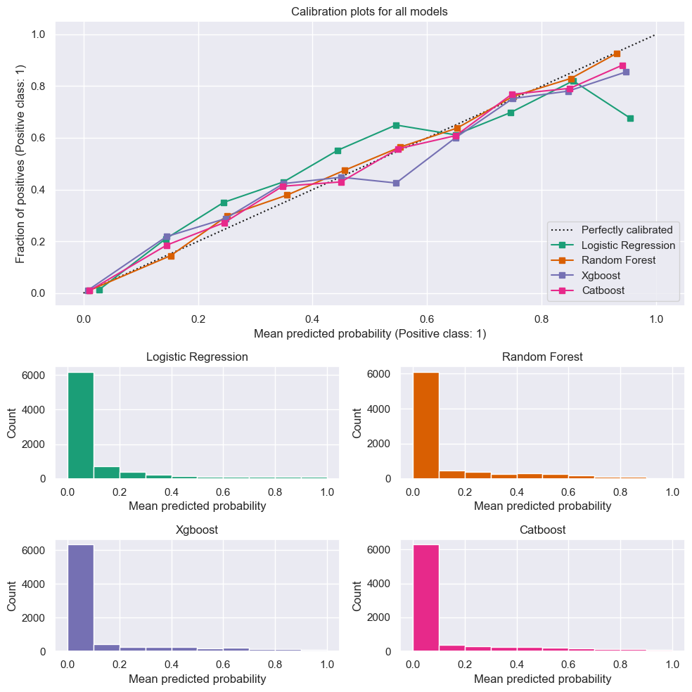
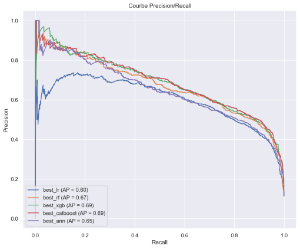
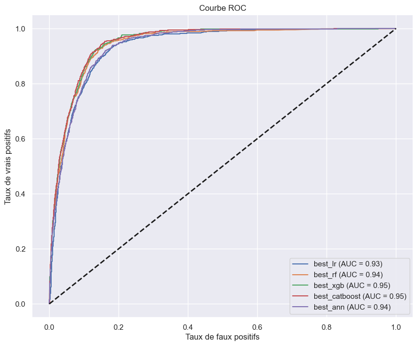
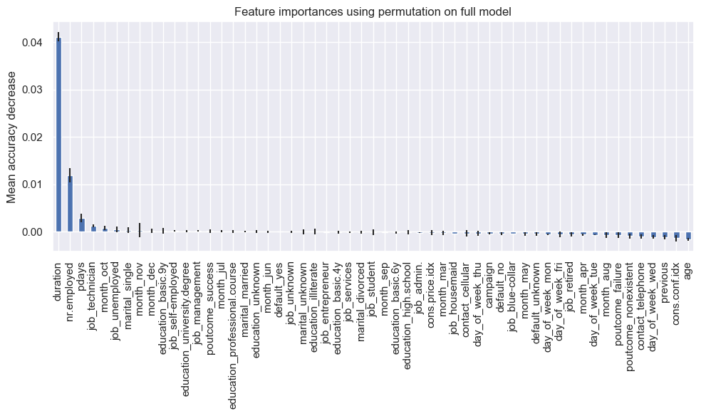

# Banking predictions results

## Abstrait

Une banque souhaitant faire une campagne marketing auprès de prospects afin de prévoir ceux qui sont susceptibles d’ouvrir un compte courant via des méthodes statistiques d'apprentissages avec un ou des modèles en fonction des caractéristiques de ces prospects. Il s'agit d'un problème de classification.  

## Overall metrics results

<table border="1" class="dataframe">
  <thead>
    <tr style="text-align: right;">
      <th></th>
      <th>recall</th>
      <th>precision</th>
      <th>f1</th>
      <th>accuracy</th>
      <th>auc_score</th>
    </tr>
  </thead>
  <tbody>
    <tr>
      <th>best_lr</th>
      <td>0.421725</td>
      <td>0.678082</td>
      <td>0.520026</td>
      <td>0.911233</td>
      <td>0.934354</td>
    </tr>
    <tr>
      <th>best_rf</th>
      <td>0.489883</td>
      <td>0.677467</td>
      <td>0.568603</td>
      <td>0.915240</td>
      <td>0.944159</td>
    </tr>
    <tr>
      <th>best_xgb</th>
      <td>0.560170</td>
      <td>0.676963</td>
      <td>0.613054</td>
      <td>0.919369</td>
      <td>0.949215</td>
    </tr>
    <tr>
      <th>best_catboost</th>
      <td>0.537806</td>
      <td>0.695592</td>
      <td>0.606607</td>
      <td>0.920461</td>
      <td>0.949933</td>
    </tr>
    <tr>
      <th>best_ann</th>
      <td>0.534611</td>
      <td>0.632242</td>
      <td>0.579342</td>
      <td>0.911475</td>
      <td>0.938765</td>
    </tr>
  </tbody>
</table>

## Calibration

Dans cette partie, nous analysons la calibration du modèle. La sortie des modèles étant des scores de probabilités on attendrait d'un modèle parfaitement calibré que lorsque ce dernier prédit une probabilité de 90%,
la proportion observée soit effectivement de 90% ; et ce pour tout pourcentage.

    

L'ensemble des modèles sont relativement bien calibrés avec Catboost comme modèle ayant la meilleure calibration. 

## PR Curve

    

    

## ROC Curve
    

    

Nous décidons également de regarder la feature importance de notre meilleur modèle. Pour
cela nous utilisons la méthode des permutations implémentée par Sklearn.
Cette méthode consiste à mesurer la diminution de la performance d'un modèle lorsqu'on
permute de manière aléatoire les valeurs d'une caractéristique particulière, ce qui permet de
quantifier l'impact de cette caractéristique sur les prédictions du modèle. Plus la performance
du modèle diminue après permutation, plus la caractéristique est jugée importante

## Feature importance using permutation

    

    

Nous voyons dès lors que sur les 55 variables, beaucoup ne sont que peu significatives.
Également que la variable duration a une part importante dans l’explicabilité.

